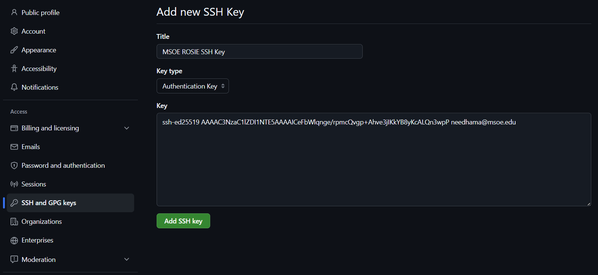

<br>
<a href='/learning-tree?node=84' style='
    background-color: #31313a;
    color: gainsboro;
    padding: 6px 16px;
    border: none
    border-radius: 4px;
    text-transform: uppercase;
    font-family: "Roboto", sans-serif;
    font-size: 1em;
    font-weight: bold;
    cursor: pointer;
    text-decoration: none;
    display: inline-block;'
>
  View in Learning Tree
</a>

<br>
<br>
<br>

<div style='
  position: relative;
  padding: 10px; 
  border-radius: 5px;
  background-color: rgba(0, 0, 0, 0.85); 
  border: 4px solid transparent;
  background-image: linear-gradient(90deg, rgba(0, 0, 0, 0.85), rgba(0, 0, 0, 0.85)), linear-gradient(90deg, gold, orange, gold);
  background-origin: border-box;
  background-clip: padding-box, border-box;
'>

<svg width='200' height='50' style='display: block; margin-bottom: 5px;'>
  <text x='0' y='35' font-size='35' font-family='Arial' font-weight='bold' fill='gold'>
    Why Read?
    <animate attributeName='fill' values='gold; orange; gold' dur='3s' repeatCount='indefinite' />
  </text>
</svg>

<p style='color: white; margin-top: 2px;'>This article will guide you through setting up SSH keys to connect to GitHub from Rosie or other devices. This will allow you to clone, push, and pull repositories securely without needing to enter your username and password each time.
</p>

</div>

<br/>

<br/>

## What are SSH Keys?
SSH (Secure Shell) keys are a pair of cryptographic keys used for secure authentication between your computer and GitHub. They consist of a public key, which you add to your GitHub account, and a private key, which remains on your device. When you connect to GitHub, the keys work together to verify your identity without transmitting sensitive information like passwords.

Each device you use to access GitHub should have its own unique SSH key pair.

You can follow these steps to set up SSH keys for GitHub on ROSIE, your local machine, or any other device that you use for development.

## Steps to Set Up SSH Keys for GitHub

1. **Check for Existing SSH Keys**
   
   First, check if you already have SSH keys on your device. Open a terminal and run:
   
   ```bash
   ls -al ~/.ssh
   ```

   Look for files named `id_ed25519` and `id_ed25519.pub` or `id_rsa` and `id_rsa.pub` or similar. If they exist, you can use them; otherwise, proceed to the next step to generate new keys.

2. **Generate a New SSH Key Pair**
    
    If you don't have existing keys, generate a new SSH key pair by running:
    
    ```bash
    ssh-keygen -t ed25519 -C "<your_email@example.com>"
    ```

    When prompted, you can press Enter to accept the default file location. You can also set a passphrase for added security or leave it empty.

3. **Add Your SSH Key to the SSH-Agent**

    Start the SSH agent in the background:
    
    ```bash
    eval "$(ssh-agent -s)"
    ```

    Then add your SSH private key to the agent:
    
    ```bash
    ssh-add ~/.ssh/id_ed25519
    ```

4. **Add the SSH Key to Your GitHub Account**
    Copy the contents of your public SSH key to your clipboard. Use this command to show the contents of the public key and copy it:

    > Important! Make sure to use the public key file, not the private key. The public key usually has a `.pub` extension.
    
    ```bash
    cat ~/.ssh/id_ed25519.pub
    ```

    Go to GitHub, navigate to **Settings > SSH and GPG keys**, and click **New SSH key**. Paste your public key into the "Key" field and give it a descriptive title. Click **Add SSH key** to save.

    It should look something like this:

    

5. **Test the SSH Connection**

   After saving your SSH key to your GitHub account, you can test the connection. To test your SSH connection, run the following command:

   ```bash
   ssh -T git@github.com
   ```

   If everything is set up correctly, you should see a message like:

   ```
   Hi <username>! You've successfully authenticated, but GitHub does not provide shell access.
   ```

   If you encounter any issues, double-check your SSH key setup and ensure that your public key is added to your GitHub account.


Now you should be able to use SSH to interact with your GitHub repositories using commands like `git clone`, `git push`, and `git pull` securely without needing to enter your username and password each time.


## Related Articles

Check out these related articles for more information about using Git and GitHub or setting up SSH connection to Rosie:

### Using Git commands

[Check out this article](/library/?nav=Articles&article=Git-Commands) for common Git commands to use with your repositories.

### Setting up SSH on Rosie

[Check out this article](/library/?nav=Articles&article=6-rosie-ssh) for connecting to Rosie using SSH and VSCode.